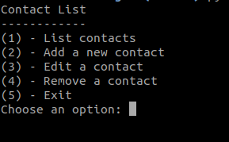

# contact-list
A simple contact list made with python



## Project setup
### Clone the repository
```
git clone git@github.com:tiagopaes/contact-list.git
```

### Enter in the project folder
```
cd contact-list
```

### Run the `Main.py`
```
python Main.py
```
